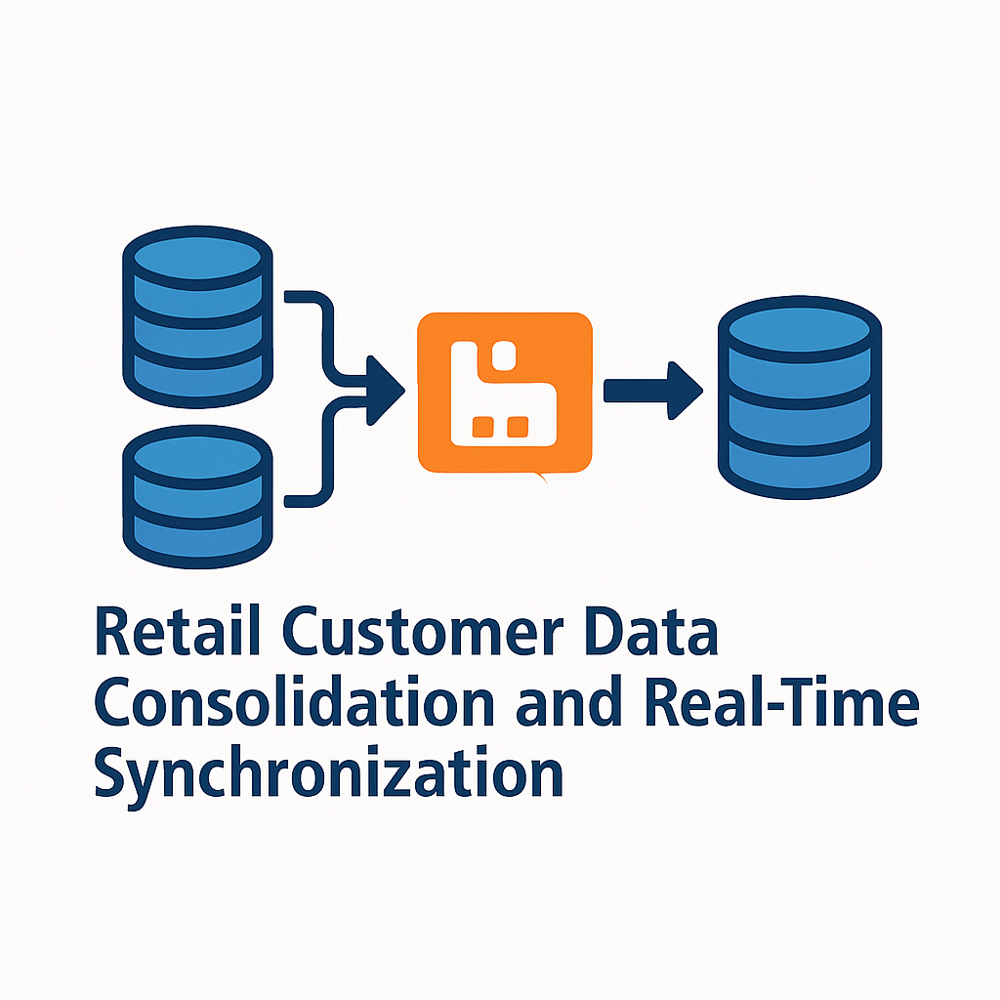

# Real-Time-Data-Synchronization-Using-CDC
  
  
  
  
  

---

## 🚀 About The Project

**Real-Time-Data-Synchronization-Using-CDC** is a high-performance, event-driven Java-based solution designed to **capture and synchronize customer data** in real time using **Change Data Capture (CDC)** — not polling.

It monitors source databases like POS systems and e-commerce platforms using **WAL (Write-Ahead Logging)** and Debezium to stream changes, ensuring instant, reliable, and low-latency data flow through **RabbitMQ** to a target system like **PostgreSQL**.

---

## 🧠 Why CDC and Not Polling?

> Traditional polling is inefficient, delayed, and resource-heavy.  
> This project leverages **CDC via Debezium**, enabling **real-time and low-overhead synchronization** by listening to the **actual database change logs** (WAL in PostgreSQL).

---

## 🛠️ Key Features

- ✅ **Real-Time CDC-Based Syncing** — Instantly captures and transmits inserts, updates, and deletes  
- ✅ **Debezium Embedded Engine** — No Kafka setup required  
- ✅ **RabbitMQ Message Queue** — Asynchronous, fault-tolerant messaging  
- ✅ **PostgreSQL WAL Capture** — Efficient and accurate data change tracking  
- ✅ **JSON Payload Processing** — Structured and standardized messages  
- ✅ **Modular Microservices** — Clean separation between producer (CDC) and consumer (sync handler)

---

## 🏗️ Built With

| Technology        | Purpose                                      |
|-------------------|----------------------------------------------|
| **Java 17**       | Backend services                             |
| **Spring Boot**   | Fast, configurable microservices             |
| **Debezium**      | WAL-based CDC connector                      |
| **RabbitMQ**      | High-throughput message broker               |
| **PostgreSQL**    | WAL-enabled source/target database           |
| **MS SQL Server** | Source database for capturing business data  |
| **Maven**         | Build and dependency management              |

---

## ⚙️ How It Works

1. **PostgreSQL** and **MS SQL Server** act as **source systems**.
2. **Debezium Embedded Engine** captures changes (INSERT, UPDATE, DELETE) via **WAL logs**.
3. Changes are formatted into **JSON messages** and published to **RabbitMQ**.
4. The **Spring Boot consumer** service receives the messages from RabbitMQ.
5. The consumer stores the data in the **final PostgreSQL consolidated database** or **updates accordingly**.

---

## 📦 Installation & Setup

### 1. Clone the Repository
```bash
git clone https://github.com/Yatish-7/Real-Time-Data-Synchronization-Using-CDC.git
cd Real-Time-Data-Synchronization-Using-CDC
